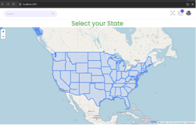
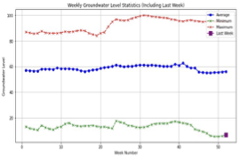
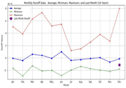
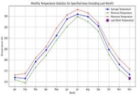
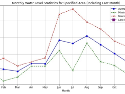
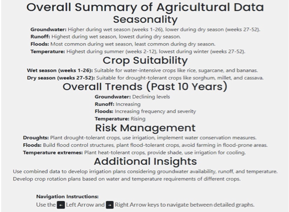
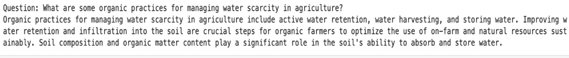
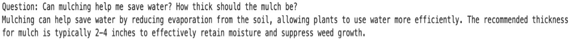

# Canopy: Insights for Farmers

Canopy is a project developed during the NASA Space Apps Challenge 2024 to assist the agricultural community in water-related environmental decision-making. By integrating satellite data, geospatial datasets, and AI-driven insights, Canopy simplifies complex information into actionable insights for farmers.

---

## Problem Statement
The agricultural community faces significant challenges due to water-related environmental factors such as groundwater levels, floods, runoff, and temperature fluctuations. Farmers require reliable and easy-to-understand tools to:

- Analyze long-term environmental trends.
- Make informed decisions regarding water management and farming practices.
- Adopt sustainable practices like organic farming effectively.

---

## Our Approach
We designed Canopy to be a comprehensive and user-friendly solution by focusing on three key pillars:

1. **Data Integration and Processing:**
    - Utilizing NASA's satellite and geospatial datasets.
    - Aggregating 10 years of data on groundwater, runoff, floods, and temperature trends.
    
2. **Interactive Visualization:**
    - Developing interactive graphs to display comparisons and trends.
    - Presenting insights in an intuitive manner, tailored for farmers' understanding.

3. **AI-Powered Assistance:**
    - Using AI to summarize insights from data visualizations.
    - Implementing a Retrieval-Augmented Generation (RAG) chatbot to provide expert guidance on organic farming best practices.

---

## Features

### 1. Data Processing and Analysis
- Processed and analyzed a decade's worth of environmental data to identify key patterns and trends.
- Focused on the aggregation and comparison of max, min, and mean values across 52 weeks for:
  - Groundwater
  - Runoff
  - Floods
  - Temperature

### 2. Interactive Visualization
- Designed interactive and easy-to-understand graphs to:
  - Highlight historical comparisons.
  - Present trends in water availability, temperature, and other critical metrics.

### 3. AI-Driven Insights
- Used AI models to summarize results derived from the interactive visualizations.
- Developed an AI RAG chatbot capable of:
  - Answering user queries on agricultural best practices.
  - Providing detailed guidance on adopting sustainable and organic farming techniques.

---

## What I Worked On
As a core contributor to the Canopy project, my contributions included:

1. **Data Processing and Trend Analysis:**
   - Processed and analyzed 10 years of environmental data to extract meaningful trends.
   - Focused on making the insights relevant and actionable for farmers.

2. **Interactive Visualizations:**
   - Designed and implemented interactive, easy-to-understand graphs to:
     - Compare historical trends.
     - Display correlations and patterns visually.

3. **AI-Powered Summarization:**
   - Utilized AI models to summarize insights obtained from the visualizations.
   - Ensured summaries were clear, concise, and actionable.

4. **AI RAG Chatbot:**
   - Built an AI chatbot capable of:
     - Providing expert advice on organic farming best practices.
     - Answering user questions by leveraging a retrieval-augmented generation (RAG) framework.

---

## Screenshots
*Initial Interface of the Dashboard Application

### Interactive Graphs
*Visuals showcasing trends in water availability and temperature.*

### AI Summaries 
*Snapshots of the summarization over the obtained plots*

### AI Chatbot Interface
*Snapshots of the chatbot answering queries on organic farming.*

---

## Achievements
- We Won 'Judges Choice Award' at NASA Space Apps Challenge Chicago out of 34 teams participating in the hackathon.

---

## Future Work
- Incorporate real-time data streaming for more dynamic insights.
- Enhance chatbot capabilities to support multilingual interactions.
- Expand the scope of recommendations to include crop-specific guidance.

---

## Acknowledgments
- NASA Space Apps Challenge for inspiring this project.
- Team Canopy for their collaborative efforts.
- The agricultural community for their invaluable feedback and insights.
